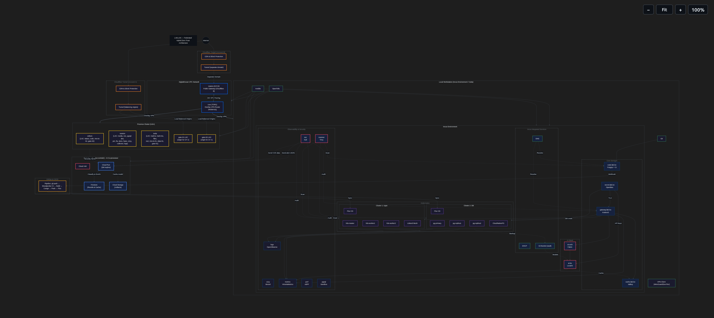

<div align="left">
  
  
  <br/>
  
  <h1>About me</h1>
  
  <p>
    Pursuing a structured learning path in <b>Infrastructure Engineering (metal → cloud)</b> and <b>Platform Engineering (runtime → GitOps)</b>.
  </p>
  
  <p>
    I build and operate real labs on physical hardware to understand the complete stack—from bare-metal virtualization, system containers (LXC), and the Linux kernel to enterprise Kubernetes platforms and declarative GitOps workflows.
  </p>

  <br/>

  <blockquote>
    <h3>"Fast & Secure by Design"</h3>
  </blockquote>
</div>

<br/>

<div align="center">
  
  
  
  
  
  
  
  
</div>

<br/>

##  Core Engineering Domains

<table>
  <tr>
    <td width="50%" valign="top">
      <h3> Infrastructure <span>(metal → cloud)</span></h3>
      <p>Building reliable infrastructure from physical hardware to cloud platforms.</p>
      <p>My focus includes Linux systems, hardware virtualization, storage architectures, networking, and cloud infrastructure, where performance starts with the operating system and every layer builds on a solid foundation.</p>
    </td>
    <td width="50%" valign="top">
      <h3> Platform <span>(runtime → GitOps)</span></h3>
      <p>Designing platforms where infrastructure becomes a service.</p>
      <p>I focus on application/system containers (OCI & LXC), Kubernetes orchestration, and declarative continuous delivery to supply reproducible, automated, and observable environments.</p>
    </td>
  </tr>
  <tr>
    <td width="50%" valign="top">
      <h3> Performance</h3>
      <p>Performance engineering from the Linux kernel to the application.</p>
      <p>I prefer measuring first using kernel-level tracing, understanding low-level bottlenecks, and optimizing only when the data justifies it.</p>
    </td>
    <td width="50%" valign="top">
      <h3> Security</h3>
      <p>Security integrated by design.</p>
      <p>From immutable infrastructure provisioning to workload execution, I work toward making security part of the engineering process rather than a final verification step.</p>
    </td>
  </tr>
  <tr>
    <td width="50%" valign="top">
      <h3> Observability</h3>
      <p>Metrics, logs and traces.</p>
      <p>Observability is about understanding system behavior and execution flows under the hood, not collecting static dashboards.</p>
    </td>
    <td width="50%" valign="top">
      <h3> Automation</h3>
      <p>Infrastructure as Code, automation and CI/CD.</p>
      <p>Deployment strategies adapt to the scale—from lightweight GitOps loops using OpenTofu/Ansible on LXC containers to fully automated Kubernetes platforms managed via Flux CD.</p>
    </td>
  </tr>
</table>

<br/>
<!-- 
##  Focus & Roadmap

<table>
  <tr>
    <td width="50%" valign="top">
      <h4>Current Focus</h4>
      <ul>
        <li>Linux Performance Engineering</li>
        <li>eBPF & Kernel Observability</li>
        <li>LXC & Light-Infrastructure GitOps</li>
        <li>Kubernetes & Cloud-Native Platforms</li>
        <li>Supply Chain Security</li>
        <li>Hybrid Cloud & Zero Trust Architectures</li>
      </ul>
    </td>
    <td width="50%" valign="top">
      <h4>Roadmap</h4>
      <ul>
        <li>Linux Internals & Advanced Systems</li>
        <li>Advanced Software-Defined Networking (Cilium, FRR, BGP)</li>
        <li>Kubernetes Multi-Cluster Federation</li>
        <li>eBPF Runtime Applications</li>
        <li>Distributed Observability Pipelines</li>
        <li>Container Image Signing & Attestation (Cosign/Sigstore)</li>
        <li>Supply Chain Hardening</li>
      </ul>
    </td>
  </tr>
</table>
-->
<br/>

##  Engineering Principles & Building

<table>
  <tr>
    <td width="50%" valign="top">
      <h4>Engineering Principles</h4>
      <ul>
        <li>Measure before optimizing.</li>
        <li>Security is designed, not added.</li>
        <li>Automate repetitive work.</li>
        <li>Document everything.</li>
        <li>Prefer simple systems over clever ones.</li>
      </ul>
    </td>
    <td width="50%" valign="top">
      <h4>Building (Current projects)</h4>
      <ul style="list-style: none; padding-left: 0;">
          <li> <a href="https://github.com/y49uil4r/lab-loc"> Hybrid Zero Trust Homelab (lab.loc)</a></li>
  <li> <a href="https://github.com/y49uil4r/book-linux-kernel-infrastructure"><i>Linux: del kernel a la infraestructura</i></a> (Linux: From Kernel to Infrastructure)</li>
  <li> <a href="https://github.com/y49uil4r/book-bash-scripting-manual"><i>Bash Scripting: manual completo para administradores de infraestructura</i></a> (Bash Scripting: Complete Manual for Infrastructure Administrators)</li>
      </ul>
    </td>
  </tr>
</table>

<br/>

##  How to Navigate This Profile

- **Main Lab Project**: All infrastructure, configuration, and architecture decisions live in the **[lab-loc](https://github.com/y49uil4r/lab-loc)** repository. Start here if you want to understand how I design, operate, and document a complete platform.
- **Deep Dives & Manuals**: I publish detailed technical books and guides as separate repositories. Each covers a specific domain (Linux kernel, performance, security, etc.). Explore the pinned repositories below or search by topic.
- **Runbooks & Operations**: Day‑2 operational procedures are part of the lab repository, written to be executed during real incidents.
- **Documentation & Reproducibility (`docs/`)**: The repository includes a dedicated `docs/` folder. Inside, **`docs/incus/`** provides the configuration files (playbooks, scripts) to fully recreate the Incus environment. **`docs/proxmox/`** contains design documentation, security policies, and sanitized command outputs to demonstrate the Proxmox cluster's capabilities without exposing sensitive customer information.
- **Everything else**: Smaller experiments, scripts, and notes live in their own repos, linked where relevant.

<br/>

##  Documentation & Architecture

Everything I learn is documented as reproducible labs and engineering manuals.
Repositories will be published as they mature.

<br/>

<details open>
<summary><b> Hybrid Zero Trust Lab — lab.loc</b></summary>
<br/>

### Case Study: LAB.LOC – Federated Hybrid Zero Trust Architecture

#### 1. Executive Summary
**LAB.LOC** is a production-grade, multi-site hybrid infrastructure designed to securely interconnect two independent small business environments across Cuba and the USA. It leverages a self-hosted **Proxmox Cluster** and a **DigitalOcean VPC backbone**, while utilizing **GCP Free Tier** as a serverless AI co-processor. The **Incus environment** (Cuba) is currently under development and will serve as the on‑premise core for K3s clusters, AI orchestration, and observability.

The architecture implements a **Zero Trust** security model across all layers and follows **GitOps** principles. With a strict Operational Expenditure (OpEx) of just **$12.00 per month**, it proves that enterprise-level security and high availability are achievable without large cloud budgets.

---

#### 2. Methodology: Agile Development with Kanban
The project was developed using **Agile principles** with a **Kanban** workflow, managed directly within the project repository (available via **GitHub Projects** or **Forgejo boards**). The board is structured with the following columns:

- **Backlog:** Architectural features and tasks pending design or prioritization (e.g., DNSMASQ integration, AI classifier).
- **To-Do:** Items selected for the current sprint, ready to be worked on.
- **In Progress:** Components actively being implemented (e.g., VPN peering, Cloudflare origins).
- **Review:** Completed components undergoing integration testing across the overlay mesh.
- **Done:** Production-ready components deployed and validated.

Sprints are time‑boxed but **flexible**, adapting to the available time I can dedicate to the lab. Each sprint focuses on delivering a functional layer of the infrastructure, ensuring continuous, iterative progress.

---

#### 3. Architectural Requirements
| Requirement | Description |
| :--- | :--- |
| **Zero Trust Security** | No implicit trust. Every connection traverses the encrypted overlay VPN, Cloudflare mTLS tunnels, or DigitalOcean VPC Peering (private, isolated network). |
| **High Availability** | Public ingress is load-balanced across at least two origins (`gate-01` & `gate-02`). |
| **FinOps Discipline** | Cloud cost must remain at **$0.00** for GCP/Cloudflare and **$12.00** total for DigitalOcean. |
| **Centralized DNS** | A unified internal DNS (`*.ts.loc`) must resolve all endpoints without external dependencies. |
| **Serverless AI Integration** | A lightweight AI model classifies security alerts from both geographies using only GCP Free Tier limits. |

---

#### 4. Implementation: The Three Pillars
- **Pillar 1: Incus Environment (Local Desktop / Cuba) – Planned** – Will host the core K3s clusters, AI orchestration (Fabric/LocalAI), OpenBao, and observability. It will remain completely isolated from the public internet, communicating only via the encrypted overlay VPN.
- **Pillar 2: Proxmox Cluster (USA)** – A dedicated cluster (`edison`, `newton`, `tesla`) running business-critical LXC containers. It hosts the redundant ingress gates (`gate-01` & `gate-02`), which serve as load-balanced origins for Cloudflare.
- **Pillar 3: Cloud Backbone (DigitalOcean + GCP)** – Two DigitalOcean droplets ($6.00 each) act as the routing and public-facing entry points. `core` (TOR1) functions as the **overlay VPN router** and central **DNSMASQ server** for `*.ts.loc`. `rutams` (NYC3) serves as a public gateway for administrative APIs. **GCP Free Tier** acts as the AI Co-processor, receiving and classifying vulnerability alerts from Trivy/Kali.

---

### 5. Network Topology & DNS

The **LAB.LOC** network is built around a single **encrypted overlay VPN** (`ts.loc`) that interconnects all sites. `core` (TOR1) acts as the central router and DNS server.

#### 5.1. Overlay VPN Subnets & Node Addressing
The overlay uses the private IPv4 space `172.16.66.128/25`. Each node is assigned a unique IP within that range:
- **Core router (`core`, TOR1):** fixed IP in the `.130` range.
- **Proxmox nodes (USA):** `edison`, `newton`, `tesla` – each has a dedicated IP in the `.240–.250` range.
- **Workstation (`gandalf`, Cuba):** IP in the `.250–.255` range (Incus host).

Static routes forward traffic to adjacent private networks:
- `172.16.63.128/25` → NYC3 (`rutams` services)
- `172.16.64.128/25` → internal auxiliary services
- `192.168.186.128/25` → Proxmox cluster management LAN

#### 5.2. DNS Delegation
A **DNSMASQ** instance on `core` is authoritative for the `*.ts.loc` domain, resolving internal records (`gate-01`, `gate-02`, `rutams`, etc.) without external DNS dependencies. All VPN participants use `core` as their primary resolver.

#### 5.3. VPC Peering
`core` (TOR1) and `rutams` (NYC3) are connected via **DigitalOcean's native VPC Peering**, providing low‑latency, zero‑cost communication without traversing the public internet.

#### 5.4. Security Controls (Zero Trust)
- **Encryption & Auth:** The VPN is designed to use WireGuard (ChaCha20‑Poly1305 + Curve25519) with mutual peer authentication. While WireGuard inherently provides strong encryption and a lightweight security model, the full security posture—including advanced hardening, key rotation, and additional policy enforcement—is planned for a future iteration as part of the roadmap's incremental delivery. Currently, the foundational tunnel is operational, with ongoing work to mature its security controls.
- **Segregation:** `incusbr0` (local container bridge) is completely isolated from the overlay; traffic must explicitly route through the host's VPN interface.
- **Access Control:** Firewalls on all endpoints enforce `default‑deny` inbound policies, only allowing established connections and required overlay services.
- **Monitoring & Updates:** VPN connection logs and DNS queries are tracked; private keys are stored securely (via OpenBao) and rotated periodically.

> 📌 *Want to see the actual routing tables, interface configs, and how we balance performance with security? Head over to [docs/performance-security/fast-and-secure-by-design.md](docs/performance-security/fast-and-secure-by-design.md) – it’s packed with real examples and trade-offs from our “Fast & Secure by Design” philosophy.*

---

#### 6. Cost Discipline (FinOps) – $12 Framework
| Component | Service | Monthly Cost | Logic |
| :--- | :--- | :--- | :--- |
| **Core Router** | DigitalOcean Droplet (TOR1) - `core` | **$6.00** | VPN router, DNSMASQ, VPC endpoint. |
| **Public Gateway** | DigitalOcean Droplet (NYC3) - `rutams` | **$6.00** | Public ingress for administrative APIs. |
| **AI / Compute** | GCP Free Tier (Cloud Run, Firestore, Cloud Storage) | **$0.00** | 2M req/mo, 50k reads/day, 5 GB storage. |
| **Security / CDN** | Cloudflare Free Tier (Two accounts) | **$0.00** | DDoS protection, TLS termination, origin load-balancing. |
| **Total OpEx** | | **$12.00 / Month** | |

---

#### 7. Security Posture (Zero Trust)
- **Micro-Segmentation:** Subnets are strictly isolated (`172.16.66.0/25` for VPN, `192.168.186.0/25` for Proxmox LAN). Routing tables are static to prevent lateral movement.
- **No Direct Internet Exposure:** Incus and Proxmox internal services have zero public IPs. The only exposed points are the Cloudflare Tunnels.
- **Continuous Verification:** Every component is continuously scanned (`Trivy` for containers, `Kali` for network penetration) and monitored (`VictoriaMetrics`, `OpenObserve`).
- **Least Privilege IAM:** Cloud Run functions are authenticated using short-lived OIDC tokens generated from GCP Service Accounts.

---

#### 8. Architecture Diagram (Current State)



<details>
<summary>View Mermaid source code</summary>
```mermaid
%%{init: {'themeVariables': {'clusterBkg': 'transparent'}}}%%
graph TB
    %% Styles
    classDef cf fill:#1a1a2e,stroke:#f6821f,stroke-width:3px,color:#eaeaea
    classDef gcpId fill:#1a1a2e,stroke:#e94560,stroke-width:3px,color:#eaeaea
    classDef core fill:#16213e,stroke:#0f3460,stroke-width:3px,color:#eaeaea
    classDef k8s fill:#1a1a2e,stroke:#533483,stroke-width:3px,color:#eaeaea
    classDef ai fill:#16213e,stroke:#e94560,stroke-width:3px,color:#eaeaea
    classDef obs fill:#1a1a2e,stroke:#0f3460,stroke-width:3px,color:#eaeaea
    classDef sec fill:#16213e,stroke:#e94560,stroke-width:3px,color:#eaeaea
    classDef gitops fill:#1a1a2e,stroke:#f5a623,stroke-width:3px,color:#eaeaea
    classDef svc fill:#16213e,stroke:#4285f4,stroke-width:3px,color:#eaeaea
    classDef desktop fill:#1a1a2e,stroke:#2d6a4f,stroke-width:3px,color:#eaeaea
    classDef infra fill:#16213e,stroke:#2d6a4f,stroke-width:3px,color:#eaeaea
    classDef do fill:#1a1a2e,stroke:#0069ff,stroke-width:3px,color:#eaeaea
    classDef proxmox fill:#1a1a2e,stroke:#eebd22,stroke-width:3px,color:#eaeaea
    classDef boundary fill:transparent,stroke:#495057,stroke-width:2px,stroke-dasharray: 8 4,color:#6c757d

    TITLE["LAB.LOC — Federated Hybrid Zero Trust Architecture"]
    style TITLE fill:#0d1117,stroke:none,color:#eaeaea,font-size:16px

    INTERNET((Internet))

    subgraph CF_GATE["Cloudflare Tunnel (Account A)"]
        CDN_GATE["CDN & DDoS Protection"]
        TUNNEL_GATE["Tunnel (balancing origins)"]
    end
    class CDN_GATE,TUNNEL_GATE cf
    class CF_GATE boundary

    subgraph CF_RUTAMS["Cloudflare Tunnel (Account B)"]
        CDN_RUT["CDN & DDoS Protection"]
        TUNNEL_RUT["Tunnel (separate domain)"]
    end
    class CDN_RUT,TUNNEL_RUT cf
    class CF_RUTAMS boundary

    subgraph LOCAL_ENV["Local Workstation (Incus Environment / Cuba)"]
        TOFU["OpenTofu"]
        ANSIBLE["Ansible"]
        GIT["Git"]
        VPN_CLIENT["VPN Client (WireGuard/ZeroTier)"]

        subgraph INCUS_ENV["Incus Environment"]
            subgraph CORE_SVC["Core Services"]
                GATEWAY["gateway.lab.loc<br/>KrakenD"]
                CACHE["cache.lab.loc<br/>Valkey"]
                SECRET["secret.lab.loc<br/>OpenBao"]
                CODE["code.lab.loc<br/>Forgejo + CI"]
            end
            subgraph K3S["Kubernetes"]
                subgraph C1["Cluster 1: Apps"]
                    C1M["k3s-master.lab.loc"]
                    C1W1["k3s-worker1.lab.loc"]
                    C1W2["k3s-worker2.lab.loc"]
                    C1S["Linkerd Mesh"]
                    C1F["Flux CD"]
                end
                subgraph C2["Cluster 2: DB"]
                    C2M["pg-primary.lab.loc"]
                    C2R1["pg-replica1.lab.loc"]
                    C2R2["pg-replica2.lab.loc"]
                    C2S["CloudNativePG"]
                    C2F["Flux CD"]
                end
            end
            subgraph AI["AI Stack"]
                AIORCH["ai-orch.lab.loc<br/>Fabric"]
                AIBE["ai-be.lab.loc<br/>LocalAI"]
                MCP["mcp.lab.loc<br/>MCP Server"]
            end
            subgraph OBSEC["Observability & Security"]
                LOGS["logs.lab.loc<br/>OpenObserve"]
                O11Y["o11y.lab.loc<br/>Beszel"]
                METRICS["metrics.lab.loc<br/>VictoriaMetrics"]
                SEC["sec.lab.loc<br/>Kali"]
                SCANNER["scanner.lab.loc<br/>Trivy"]
                PERF["perf.lab.loc<br/>eBPF"]
                PGSQL["pgsql.lab.loc<br/>Sandbox"]
                CA["ca.lab.loc<br/>Smallstep CA"]
            end
            subgraph INCUS_INFRA["Incus Integrated Services"]
                DNS["DNS"]
                DHCP["DHCP"]
                S3["S3 Bucket (vault)"]
            end
        end
    end
    class TOFU,ANSIBLE,GIT,VPN_CLIENT desktop
    class GATEWAY,CACHE,SECRET,CODE core
    class C1M,C1W1,C1W2,C2M,C2R1,C2R2 k8s
    class C1S,C2S,C1F,C2F k8s
    class AIORCH,AIBE,MCP ai
    class LOGS,O11Y,METRICS,CA obs
    class SEC,SCANNER sec
    class PERF,PGSQL obs
    class DNS,DHCP,S3 infra
    class CORE_SVC,K3S,AI,OBSEC,INCUS_INFRA boundary
    class LOCAL_ENV,INCUS_ENV boundary

    subgraph DO_VPC["DigitalOcean VPC Network"]
        CORE["core (TOR1)<br/>Overlay VPN Router<br/>DNSMASQ"]
        RUTAMS["rutams (NYC3)<br/>Public Gateway (Cloudflare B)"]
    end
    class CORE,RUTAMS do
    class DO_VPC boundary

    subgraph PROXMOX_USA["Proxmox Cluster (USA)"]
        EDISON["edison<br/>(LXC: status, code, rms-ts-02, gate-02)"]
        NEWTON["newton<br/>(LXC: media, ns1, pgsql-dev,<br/>pm, fia, store, hass, o11y, collector, logs)"]
        TESLA["tesla<br/>(LXC: mail-ts, mail-rms, files,<br/>ns2, rms-ts-01, data-01, gate-01)"]
        GATE01["gate-01 LXC<br/>(origin for CF A)"]
        GATE02["gate-02 LXC<br/>(origin for CF A)"]
    end
    class EDISON,NEWTON,TESLA,GATE01,GATE02 proxmox
    class PROXMOX_USA boundary

    subgraph GCP["GCP Free Tier (us-central1) - AI Co-processor"]
        IAM["Cloud IAM"]
        CLOUDRUN["Cloud Run<br/>(2M req/mo)"]
        FIRESTORE["Firestore<br/>(Results & Cache)"]
        STORAGE["Cloud Storage<br/>(Artifacts)"]
    end
    class IAM gcpId
    class CLOUDRUN,FIRESTORE,STORAGE svc
    class GCP boundary

    subgraph GITOPS["GitOps & CI/CD"]
        PIPE["Pipeline: git push → Woodpecker CI → Build → Cosign → Push → Flux"]
    end
    class PIPE gitops
    class GITOPS boundary

    %% -- External Access --
    INTERNET --> CDN_GATE
    CDN_GATE --> TUNNEL_GATE
    TUNNEL_GATE -->|"Load Balanced Origins"| GATE01
    TUNNEL_GATE -->|"Load Balanced Origins"| GATE02

    INTERNET --> CDN_RUT
    CDN_RUT --> TUNNEL_RUT
    TUNNEL_RUT -->|"Separate Domain"| RUTAMS

    %% -- Provisioning & Management --
    TOFU --> INCUS_ENV
    TOFU --> PROXMOX_USA
    TOFU --> DO_VPC
    TOFU --> GCP
    ANSIBLE --> INCUS_ENV
    ANSIBLE --> PROXMOX_USA
    ANSIBLE --> DO_VPC
    ANSIBLE --> GCP
    GIT --> CODE

    %% -- Network Interconnections --
    RUTAMS ==>|DO VPC Peering| CORE
    CORE ==>|Overlay VPN| LOCAL_ENV
    CORE ==>|Overlay VPN| PROXMOX_USA

    %% -- GCP Integration --
    KALI -.->|"Send alert JSON"| CLOUDRUN
    SCANNER -.->|"Send CVE data"| CLOUDRUN
    CLOUDRUN -->|"Classify & Enrich"| FIRESTORE
    CLOUDRUN -.->|"Cache model"| STORAGE
    
    PROXMOX_USA -.->|"Security Alerts"| CLOUDRUN

    %% -- Internal Traffic --
    GATEWAY --> CACHE
    GATEWAY --> C1
    GATEWAY --> C2
    GATEWAY --> AIORCH
    GATEWAY --> MCP
    AIORCH --> AIBE
    AIBE -.->|Cache| CACHE

    C1 --> LOGS
    C1 --> METRICS
    C2 --> LOGS
    C2 --> METRICS
    GATEWAY --> METRICS
    AIBE --> METRICS

    CODE -->|Webhook| PIPE
    PIPE -->|Sync| C1F
    PIPE -->|Sync| C2F
    C1F --> C1
    C2F --> C2

    SCANNER -.->|Scan| CODE
    SCANNER -.->|Scan| C1
    SCANNER -.->|Scan| C2
    KALI -.->|Audit| C1
    KALI -.->|Audit| C2
    KALI -.->|Audit| GATEWAY

    C2 -.->|Backup| S3
    S3 -.->|Models| AIBE

    SECRET -->|TLS| GATEWAY
    SECRET -->|DB creds| C2
    SECRET -->|API keys| AIBE

    DNS -.->|Resolve| GATEWAY
    DNS -.->|Resolve| CODE
    ```
</details>

### 9. Next Steps & Roadmap (Project Kanban Board)

**Current operational status:**  
The **Proxmox Cluster (USA)** is fully operational, with:
- Cloudflare tunnels configured for both external domains (Account A for `gate-01/02`, Account B for `rutams`).
- DNS records (SPF, DKIM, DMARC) properly set up and enforced for both external domains.
- DNSMASQ on `core` providing internal resolution for `*.ts.loc`.

**Building the remaining layers:**  
The **Incus environment (Cuba)** and the **GCP Free Tier** components (Cloud Run, Firestore, Cloud Storage) are both under development. The entire infrastructure is being built **iteratively, layer by layer**, with each layer deployed, validated, and integrated before moving to the next.

The following items are currently tracked on the **Project Kanban Board** (available both on GitHub and Forgejo) to guide the next phases:

---

#### Incus Environment (Cuba) – Build Phases

- [ ] **Layer 1 – Incus Base & Core Services**  
  Set up the Incus host, configure networking (bridges, VPN connection), and deploy the foundational core services: `gateway.lab.loc` (KrakenD), `cache.lab.loc` (Valkey), `secret.lab.loc` (OpenBao), and `code.lab.loc` (Forgejo + CI). Integrate the Incus integrated services: DNS, DHCP, and S3 bucket (vault).

- [ ] **Layer 2 – Kubernetes Foundation**  
  Deploy the K3s clusters (Cluster 1: Apps and Cluster 2: DB) with Flux CD for GitOps, Linkerd for service mesh, and CloudNativePG for PostgreSQL replication. Establish the GitOps pipeline (Woodpecker CI) and connect it to the code repository.

- [ ] **Layer 3 – AI Stack**  
  Deploy the AI orchestration layer: `ai-orch` (Fabric) and `ai-be` (LocalAI). Integrate with the cache and storage services, and ensure that AI workloads can access models and data.

- [ ] **Layer 4 – Observability & Security Stack**  
  Deploy the full observability suite: `logs` (OpenObserve), `o11y` (Beszel), and `metrics` (VictoriaMetrics). Set up security scanning with `scanner` (Trivy) and `sec` (Kali). Prepare the environment for eBPF performance monitoring (`perf`) and the PostgreSQL sandbox (`pgsql`).

---

#### Cloud & Federation Layers

- [ ] **Layer 5 – GCP AI Co‑Processor**  
  Deploy Cloud Run function and Firestore database; integrate with Trivy/Kali alert feeds from both Proxmox and (future) Incus.

- [ ] **Layer 6 – Backup Federation**  
  Use Cloud Storage to receive encrypted backups from the Proxmox cluster, establishing an off‑site disaster recovery point.

- [ ] **Layer 7 – Global Mesh Expansion**  
  Add a lightweight VPS in Europe to test geo‑distributed failover and latency.

---

The Kanban board is continuously updated as each layer is completed, ensuring transparent progress tracking.

 Let's connect
If you share an interest in infrastructure, platform engineering, performance, security or if you'd just like to exchange ideas feel free to reach out. I'm always open to thoughtful conversations and collaboration.
<br/>
